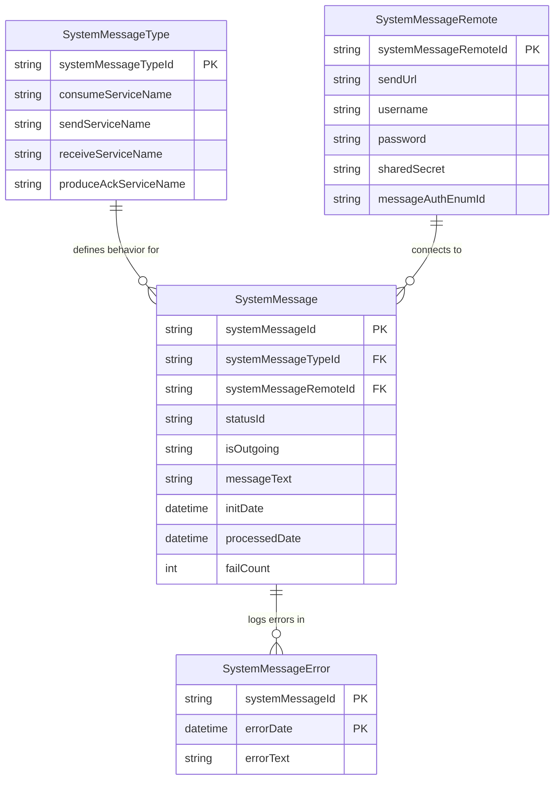
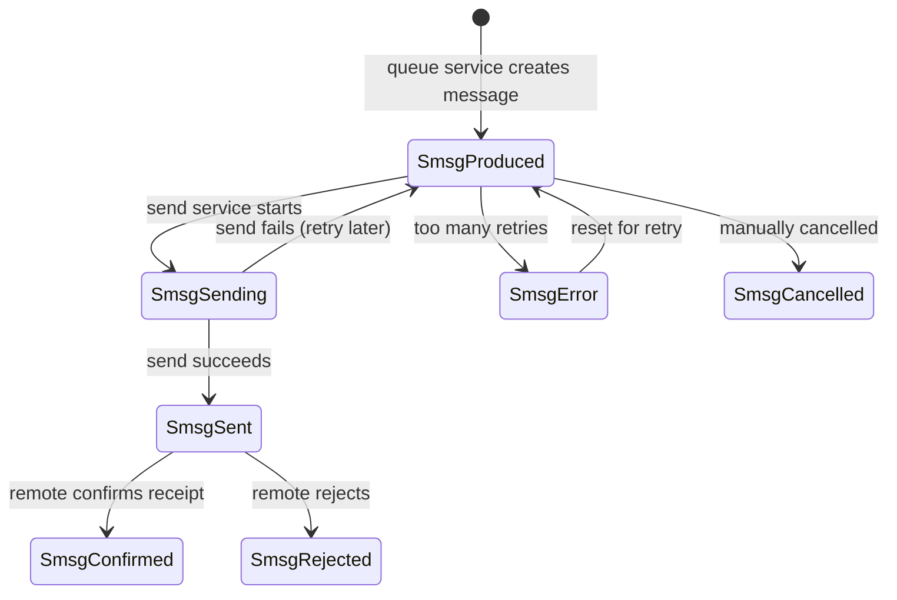
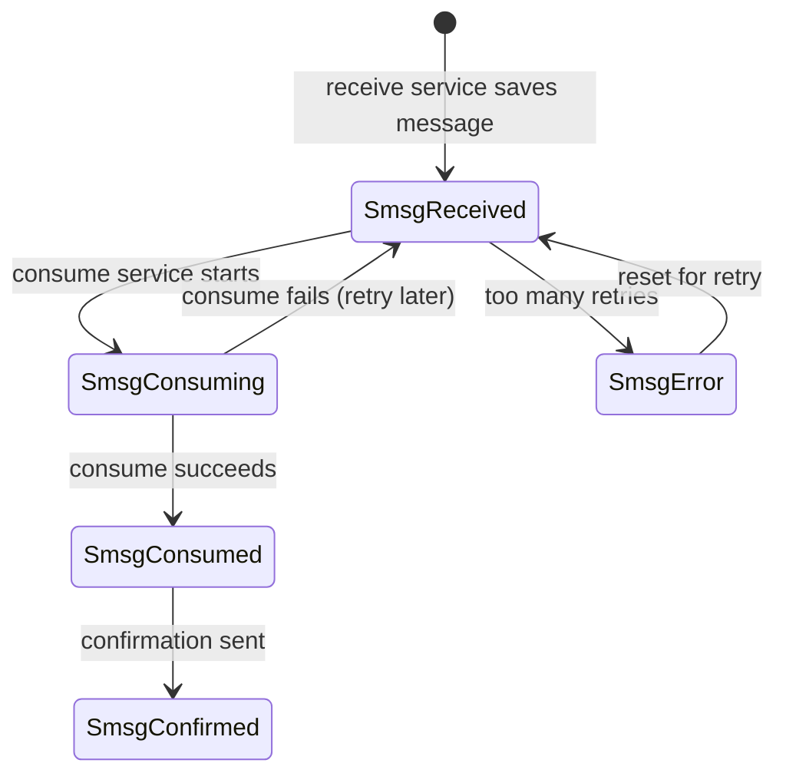
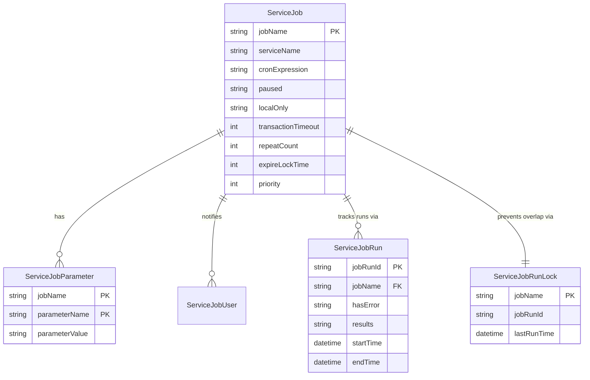
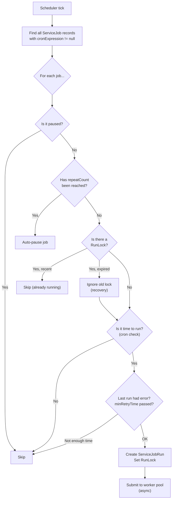
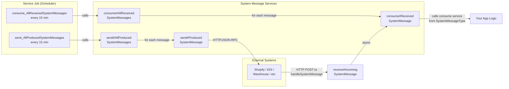

# System Message & Service Job — Beginner Guide

This guide explains two core Moqui framework concepts from your codebase. Think of them as:

| Concept | One-liner |
|---|---|
| **System Message** | A "letter" sent between your system and an external system (e.g., Shopify, an EDI partner) |
| **Service Job** | A "scheduled task" that runs automatically on a timer (like a cron job) or on-demand |

They are **related**: Service Jobs are often the mechanism that *drives* System Messages (e.g., "every 15 minutes, send all unsent messages").

---

## Part 1 — System Message

### 1.1 What Problem Does It Solve?

When your OMS needs to talk to external systems (Shopify, warehouses, EDI partners), you need a reliable way to:

1. **Receive** data from them (e.g., a new order from Shopify)
2. **Send** data to them (e.g., shipping confirmation)
3. **Track** whether each message succeeded or failed
4. **Retry** on failure
5. **Audit** what happened

System Message is Moqui's built-in framework for all of this.

### 1.2 The Key Entities (Database Tables)

There are **4 main entities** that form the System Message data model, defined in:

📄 [ServiceEntities.xml](file:///home/vaibhaviupreti/1-HW/3-sandbox-all-setup/maarg/framework/entity/ServiceEntities.xml#L139-L406)



#### What each entity does:

| Entity | Purpose | Analogy |
|---|---|---|
| **SystemMessageType** | *Configuration*. Defines what *kind* of message this is and which services handle it | Like a template — "for Shopify orders, use *this* consume service and *this* send service" |
| **SystemMessageRemote** | *Configuration*. Defines a connection to a remote system — its URL, credentials, auth type | Like an address book entry — "Shopify lives at this URL with these credentials" |
| **SystemMessage** | *Transactional*. One actual message — its text, status, direction, timestamps | The actual letter that was sent or received |
| **SystemMessageError** | *Transactional*. Error log entries when processing a message fails | The "delivery failed" notices |

### 1.3 The Status Lifecycle

Every `SystemMessage` has a `statusId` that tracks where it is in its lifecycle. The statuses are different for **outgoing** vs **incoming** messages:

#### Outgoing messages (isOutgoing = Y):



#### Incoming messages (isOutgoing = N):



> [!TIP]
> All status IDs start with `Smsg` — short for "System Message". The seed data for these statuses is embedded right inside [ServiceEntities.xml:L206-L266](file:///home/vaibhaviupreti/1-HW/3-sandbox-all-setup/maarg/framework/entity/ServiceEntities.xml#L206-L266).

### 1.4 The Services (Business Logic)

All core System Message services are in a single file:

📄 [SystemMessageServices.xml](file:///home/vaibhaviupreti/1-HW/3-sandbox-all-setup/maarg/framework/service/org/moqui/impl/SystemMessageServices.xml)

#### Service Interfaces (contracts that custom implementations must follow):

| Interface | Purpose |
|---|---|
| `receive#SystemMessage` | How to save a received message |
| `consume#SystemMessage` | How to process/use a received message |
| `send#SystemMessage` | How to transmit an outgoing message |
| `produce#AckSystemMessage` | How to create an acknowledgement |

#### Concrete Services:

| Service | What It Does |
|---|---|
| `queue#SystemMessage` | Creates an outgoing message (status = `SmsgProduced`). Optionally sends immediately. |
| `send#ProducedSystemMessage` | Picks up one message and sends it. Updates status to `SmsgSending` → `SmsgSent` or back on failure. |
| `send#SystemMessageJsonRpc` | **Send implementation** — sends via JSON-RPC to a remote Moqui system |
| `send#SystemMessageRest` | **Send implementation** — sends via REST API (POST with message body) |
| `send#SystemMessageDirectLocal` | **Send implementation** — calls the receive service directly (same JVM, for testing) |
| `receive#IncomingSystemMessage` | Saves an incoming message (status = `SmsgReceived`) and kicks off consume asynchronously |
| `consume#ReceivedSystemMessage` | Calls the type-specific consume service. Status: `SmsgConsuming` → `SmsgConsumed` |
| `send#AllProducedSystemMessages` | **Scheduled bulk sender** — finds all `SmsgProduced` messages and tries to send each one. Marks as `SmsgError` after retry limit. |
| `consume#AllReceivedSystemMessages` | **Scheduled bulk consumer** — finds all `SmsgReceived` messages and tries to consume each one |
| `reset#SystemMessageInError` | Resets a message from `SmsgError` back to `SmsgProduced`/`SmsgReceived` for retry |
| `cancel#SystemMessage` | Cancels a message (moves to `SmsgCancelled`) |

### 1.5 How a Message Flows — Outgoing Example

Imagine sending an order update to Shopify:

```
Your Code                        Framework                         Shopify
   │                                │                                 │
   │── queue#SystemMessage ──────►  │                                 │
   │   (creates SystemMessage       │                                 │
   │    status=SmsgProduced)        │                                 │
   │                                │                                 │
   │                                │── send#ProducedSystemMessage ──►│
   │                                │   (status → SmsgSending)        │
   │                                │                                 │
   │                                │   Calls sendServiceName         │
   │                                │   (e.g. send#SystemMessageRest) │
   │                                │         ──── HTTP POST ────────►│
   │                                │                                 │
   │                                │   ◄── 200 OK ──────────────────│
   │                                │   (status → SmsgSent)           │
```

### 1.6 How a Message Flows — Incoming via HTTP

External systems can push messages to Moqui via HTTP. The URL pattern is:

```
POST /apps/system/SystemMessage/{systemMessageTypeId}/{systemMessageRemoteId}
Body: the raw message text
```

This is handled by [WebFacadeImpl.handleSystemMessage()](file:///home/vaibhaviupreti/1-HW/3-sandbox-all-setup/maarg/framework/src/main/groovy/org/moqui/impl/context/WebFacadeImpl.groovy#L1136-L1299), which:

1. Validates the `systemMessageTypeId` and `systemMessageRemoteId` exist
2. Authenticates the caller (login, HMAC-SHA256, or no auth depending on config)
3. Calls `receive#IncomingSystemMessage` to save the message
4. The receive service then asynchronously calls `consume#ReceivedSystemMessage`

> [!IMPORTANT]
> Authentication is configured per-remote via `SystemMessageRemote.messageAuthEnumId`:
> - `SmatLogin` — Basic auth (username/password)
> - `SmatHmacSha256` — Webhook-style HMAC signature verification
> - `SmatHmacSha256Timestamp` — HMAC + timestamp validation (like Stripe webhooks)
> - `SmatNone` — No authentication

---

## Part 2 — Service Job

### 2.1 What Problem Does It Solve?

You often need tasks to run:
- **On a schedule** — "clean up old data every night at 2 AM"
- **On demand** — "reindex products right now"
- **With tracking** — "did that job succeed? how long did it take?"
- **With notifications** — "tell me if it failed"

Service Job is Moqui's built-in scheduler + job tracker.

### 2.2 The Key Entities

Defined in [ServiceEntities.xml:L32-L121](file:///home/vaibhaviupreti/1-HW/3-sandbox-all-setup/maarg/framework/entity/ServiceEntities.xml#L32-L121):



| Entity | Purpose |
|---|---|
| **ServiceJob** | *Configuration*. Defines the job: what service to call, when (cron), whether paused, timeout, etc. |
| **ServiceJobParameter** | *Configuration*. Default parameters to pass to the service every time the job runs |
| **ServiceJobUser** | *Configuration*. Users who receive notifications when the job runs |
| **ServiceJobRun** | *Transactional*. One execution of a job — results, errors, timing, which server ran it |
| **ServiceJobRunLock** | *Transactional*. Prevents the same job from running simultaneously on multiple servers in a cluster |

### 2.3 Key Fields on ServiceJob

| Field | What It Means | Example |
|---|---|---|
| `jobName` | Unique identifier | `"clean_ArtifactData_daily"` |
| `serviceName` | The service to call | `"org.moqui.impl.ServerServices.clean#ArtifactData"` |
| `cronExpression` | When to run (Quartz cron syntax) | `"0 0 2 * * ?"` = every day at 2:00 AM |
| `paused` | If `"Y"`, the job won't run on schedule | `"N"` |
| `localOnly` | If `"Y"`, only runs on this server (not distributed) | `"N"` |
| `transactionTimeout` | Max seconds before the job's transaction times out | `1800` (30 min) |
| `repeatCount` | Only run this many times total, then auto-pause | `null` (unlimited) |
| `expireLockTime` | Minutes before a stuck lock is ignored (recovery) | `1440` (24 hours) |
| `minRetryTime` | Minutes to wait before retrying after an error | `5` |
| `priority` | Lower number = runs first when multiple jobs are due | `null` |

> [!TIP]
> **Common cron expressions:**
> - `0 0 2 * * ?` — Every night at 2:00 AM
> - `0 0/15 * * * ?` — Every 15 minutes
> - `0 0/2 * * * ?` — Every 2 minutes

### 2.4 How the Scheduler Works

The scheduler is implemented in:

📄 [ScheduledJobRunner.groovy](file:///home/vaibhaviupreti/1-HW/3-sandbox-all-setup/maarg/framework/src/main/groovy/org/moqui/impl/service/ScheduledJobRunner.groovy)

It implements `Runnable` and is executed periodically by a Java `ScheduledExecutorService`. Here's what happens each time it runs:



### 2.5 How a Job Executes

Once the scheduler decides a job should run, it creates a [ServiceCallJobImpl](file:///home/vaibhaviupreti/1-HW/3-sandbox-all-setup/maarg/framework/src/main/groovy/org/moqui/impl/service/ServiceCallJobImpl.groovy) and submits it to a thread pool. The inner `ServiceJobCallable.call()` method:

1. **Sets up context** — creates a fresh `ExecutionContext`, logs in as the user who set up the job
2. **Records start** — updates `ServiceJobRun` with `hostAddress`, `hostName`, `runThread`, `startTime`
3. **Calls the service** — `ec.service.sync().name(serviceName).parameters(params).call()`
4. **Records results** — updates `ServiceJobRun` with `endTime`, `results` (JSON), `errors`, `hasError`
5. **Clears the lock** — removes `jobRunId` from `ServiceJobRunLock` so the job can run again next time
6. **Sends notifications** — if a `topic` is configured, sends a `NotificationMessage`; on error, always sends to `ServiceJobError` topic

### 2.6 Real Examples from Your Codebase

These jobs are defined in [MoquiSetupData.xml](file:///home/vaibhaviupreti/1-HW/3-sandbox-all-setup/maarg/framework/data/MoquiSetupData.xml#L51-L75):

| Job Name | Service | Schedule | Purpose |
|---|---|---|---|
| `clean_ArtifactData_daily` | `clean#ArtifactData` | 2:00 AM daily | Delete old hit tracking data (keep 90 days) |
| `clean_PrintJobData_daily` | `clean#PrintJobData` | 2:00 AM daily | Delete old print job data (keep 7 days) |
| `clean_ServiceJobRun_daily` | `clean#ServiceJobRun` | 2:00 AM daily | Delete old job run records (keep 30 days) |
| `send_AllProducedSystemMessages_frequent` | `send#AllProducedSystemMessages` | Every 15 min | **Connects to SystemMessage!** Sends all unsent outgoing messages |
| `consume_AllReceivedSystemMessages_frequent` | `consume#AllReceivedSystemMessages` | Every 15 min | **Connects to SystemMessage!** Processes all unprocessed incoming messages |

> [!NOTE]
> The last two jobs are **paused by default** (`paused="Y"`). You need to unpause them in the database or admin UI when you want System Messages to be processed automatically.

---

## Part 3 — How They Connect



**The pattern is:**
1. External system sends data → `handleSystemMessage` (HTTP) → saved as `SystemMessage` (Received)
2. `ServiceJob` runs `consume#AllReceivedSystemMessages` on schedule → processes each one
3. Your code produces outgoing messages → `queue#SystemMessage` → saved as `SystemMessage` (Produced)  
4. `ServiceJob` runs `send#AllProducedSystemMessages` on schedule → sends each one out

---

## Part 4 — Quick Reference

### File Locations

| What | File |
|---|---|
| Entity definitions (both) | [ServiceEntities.xml](file:///home/vaibhaviupreti/1-HW/3-sandbox-all-setup/maarg/framework/entity/ServiceEntities.xml) |
| SystemMessage services | [SystemMessageServices.xml](file:///home/vaibhaviupreti/1-HW/3-sandbox-all-setup/maarg/framework/service/org/moqui/impl/SystemMessageServices.xml) |
| HTTP receive handler | [WebFacadeImpl.groovy](file:///home/vaibhaviupreti/1-HW/3-sandbox-all-setup/maarg/framework/src/main/groovy/org/moqui/impl/context/WebFacadeImpl.groovy#L1136) |
| Job scheduler | [ScheduledJobRunner.groovy](file:///home/vaibhaviupreti/1-HW/3-sandbox-all-setup/maarg/framework/src/main/groovy/org/moqui/impl/service/ScheduledJobRunner.groovy) |
| Job execution | [ServiceCallJobImpl.groovy](file:///home/vaibhaviupreti/1-HW/3-sandbox-all-setup/maarg/framework/src/main/groovy/org/moqui/impl/service/ServiceCallJobImpl.groovy) |
| Seed data (job definitions) | [MoquiSetupData.xml](file:///home/vaibhaviupreti/1-HW/3-sandbox-all-setup/maarg/framework/data/MoquiSetupData.xml) |
| Security config | [SecurityTypeData.xml](file:///home/vaibhaviupreti/1-HW/3-sandbox-all-setup/maarg/framework/data/SecurityTypeData.xml) |

### OFBiz-OMS Side

The `ofbiz-oms` codebase also uses these concepts but with its own entity definitions:

| What | File |
|---|---|
| SystemMessageRemote & Type entities | [entitymodel.xml](file:///home/vaibhaviupreti/1-HW/3-sandbox-all-setup/ofbiz-oms/applications/hwmapps/entitydef/entitymodel.xml#L1516) |
| CRUD services for SystemMessageRemote | [services.xml](file:///home/vaibhaviupreti/1-HW/3-sandbox-all-setup/ofbiz-oms/applications/hwmapps/servicedef/hwmapps/services.xml#L554) |
| sendSystemMessageRemote (email) | [BuynowEmailServices.java](file:///home/vaibhaviupreti/1-HW/3-sandbox-all-setup/ofbiz-oms/applications/hwmapps/src/main/java/co/hotwax/buynow/buynow/BuynowEmailServices.java#L2812) |

### Glossary

| Term | Meaning |
|---|---|
| **Produce** | Create an outgoing message |
| **Queue** | Save a produced message and optionally trigger send |
| **Send** | Actually transmit a message to the remote system |
| **Receive** | Accept and save an incoming message |
| **Consume** | Process/use the data in a received message |
| **Cron Expression** | A schedule string like `"0 0 2 * * ?"` (Quartz syntax) |
| **RunLock** | A database row that prevents the same job from running concurrently |
| **Worker Pool** | Thread pool that actually executes job Callables |
